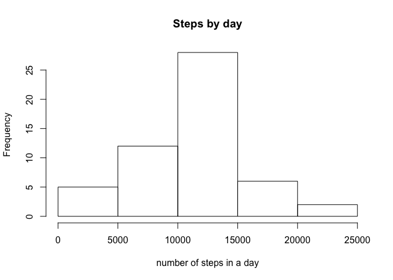
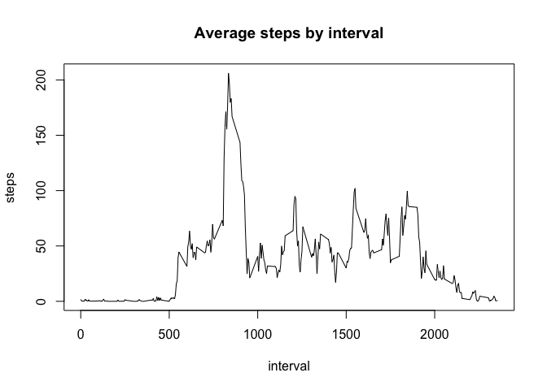
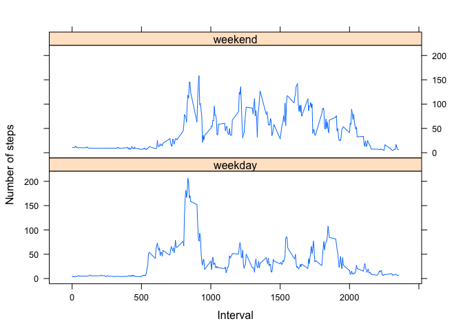

# Reproducible Research: Peer Assessment 1


## Loading and preprocessing the data
Let's extract the zip file if needed and read the data with read.csv.

```r
if(!file.exists("activity.csv")) {
    unzip("activity.zip")
}
activity <- read.csv(file="activity.csv",
                     colClasses=c("numeric","Date","numeric"))
```

## What is mean total number of steps taken per day?
Let's calculate the total number of steps taken per day, make a histogram of the
total number of steps taken each day and calculate the mean and median.

```r
stepsByDate <- aggregate(steps ~ date, activity, sum)
hist(stepsByDate$steps, main = "Steps by day", xlab = "number of steps in a day")
```

 

```r
meanStepsByDay <- mean(stepsByDate$steps)
medianStepsByDay <- median(stepsByDate$steps)
```
The mean of the total number of steps taken per day is 
**10766.189** and the median is 
**10765.000**


## What is the average daily activity pattern?
Now, we make a time series plot (i.e. type = "l") of the 5-minute interval 
(x-axis) and the average number of steps taken, averaged across all days (y-axis)

```r
averageByInterval <- aggregate(steps ~ interval, activity, mean)
plot(x=averageByInterval$interval, y=averageByInterval$steps,
     type = "l", main = "Average steps by interval",
     xlab = "interval", ylab = "steps")
```

 

```r
maxIntervalIndex <- which.max(averageByInterval$steps)
maxInterval <- averageByInterval[maxIntervalIndex,"interval"]
```
On average across all the days in the dataset, the 5-minute interval
**835** contains the maximum number of steps.

## Imputing missing values


```r
missingSteps <- is.na(activity$steps)
numMissingValues <- sum(missingSteps)
```
There are **2304** missing values.

Let's calculate the mean number of steps by interval for the complete cases and
plug those values for interval with NA steps.

```r
meanStepsByIntComp <- aggregate(steps ~ interval, activity[!missingSteps, ], mean)
```

Now let's create a new data set with missing data filled in.

```r
activityFilled <- activity
m  <- merge(activity[missingSteps, ], meanStepsByIntComp, by="interval" )$steps.y
activityFilled[missingSteps,]$steps <- m
```


```r
stepsByDate <- aggregate(steps ~ date, activityFilled, sum)
hist(stepsByDate$steps, main = "Steps by day", xlab = "number of steps in a day")
```

 

```r
meanStepsByDay <- mean(stepsByDate$steps)
medianStepsByDay <- median(stepsByDate$steps)
```
The mean of the total number of steps taken per day is 
**10766.189** and the median is 
**11015.000**  
These values **are different** from the estimates from the first part of the assignment.  
The impact of imputing missing data on the estimates of the total daily number 
of steps is that **the median has changed, but not the mean**.

## Are there differences in activity patterns between weekdays and weekends?
Let's add a weekend/weekday factor, aggregate steps by interval and this factor,
and plot the steps by interval for weekdays and weekend.

```r
activityFilled$day <- 
            factor(weekdays(activity$date)=="Sunday" | weekdays(activity$date)=="Saturday",
            levels=c(FALSE, TRUE),
            labels=c("weekday","weekend"))
averageByIntervalDay <- aggregate(steps ~ interval + day, activityFilled, mean)
library(lattice)
xyplot( steps ~ interval | day, data = averageByIntervalDay,
        layout = c(1, 2),
        type="l",
        xlab="Interval",
        ylab="Number of steps")
```

 

We can see that compared to weekdays, during weekends activity start later in 
the morning, with less steps taken until about 10:00; after 10:00 there is more 
activity in weekends than weekdays until after 20:00.
